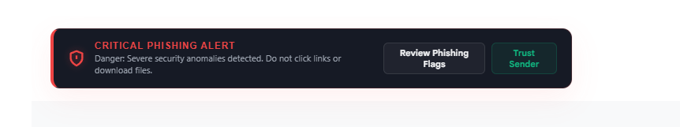
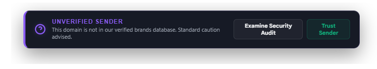

# PhishSentry

PhishSentry is a privacy-first Chrome extension that adds local phishing warnings to Gmail. It inspects the currently opened message, checks sender-domain and link-level risk signals on-device, and shows a compact warning banner before the user clicks a suspicious link.

The goal is simple: help users notice likely phishing without sending their email contents to a backend.

## Screenshots

| Critical phishing alert | Verified sender | Unverified sender |
| --- | --- | --- |
|  |  |  |

## What It Detects

- Brand impersonation in the sender display name.
- Sender domains that do not match official brand domains.
- Free-webmail abuse for corporate or financial brand claims.
- Typosquatting and lookalike sender domains.
- Link text that claims one brand domain but redirects elsewhere.
- Link destinations that resemble known brand domains.
- User-defined trusted brands and trusted sender domains.

## Privacy Model

PhishSentry is designed to run without a server.

| Data | Used for | Persisted? |
| --- | --- | --- |
| Current sender address/domain | Local sender-domain analysis | Domain only in scan history |
| Current email link URLs and link text | Local link mismatch checks | No raw links or link text are stored |
| Email subject | Not used | Not read or stored |
| Email body text | Not used, except visible anchor text for links | Not stored |
| Scan counters | Popup dashboard statistics | Stored locally in Chrome |
| Custom brands and whitelist | User configuration | Stored locally in Chrome |

There are no `fetch`, `XMLHttpRequest`, analytics, telemetry, or remote model calls in the extension. The popup also avoids remote fonts or external assets, so the extension itself does not need to contact third-party services to render its UI.

## How It Works

PhishSentry uses a Gmail content script scoped to `https://mail.google.com/*`.

1. A `MutationObserver` waits for opened Gmail message nodes.
2. The content script extracts the sender address and links from the opened message DOM.
3. `engine.js` runs local heuristics against built-in and user-defined brand rules.
4. A warning banner is injected above the message body.
5. The background service worker stores only aggregate counters and redacted scan history.

## Project Structure

```text
.
├── background.js       # MV3 service worker for local stats and redacted history
├── brands.js           # Built-in brand/domain definitions
├── content.js          # Gmail DOM scanner and injected warning banner
├── engine.js           # Local phishing heuristic engine
├── popup.html          # Extension popup shell
├── popup.css           # Popup styling
├── popup.js            # Popup state, history, settings, and current scan view
├── test_heuristics.js  # Offline Node.js heuristic tests
├── icons/              # Extension icons
└── img/                # README screenshots
```

## Install Locally

1. Clone or download this repository.
2. Open Chrome and go to `chrome://extensions`.
3. Enable **Developer mode**.
4. Click **Load unpacked**.
5. Select the repository folder.
6. Open Gmail and select an email. PhishSentry will show an inline assessment when it detects an opened message.

## Run Tests

The heuristic engine is dependency-free and can be tested with Node.js:

```bash
node test_heuristics.js
```

Expected result:

```text
Tests Summary: 18 Passed, 0 Failed
```

## Permissions

```json
{
  "permissions": ["storage", "activeTab"],
  "host_permissions": ["https://mail.google.com/*"]
}
```

- `storage` is used for local stats, redacted scan history, custom brands, and trusted domains.
- `activeTab` is used by the popup to query the active Gmail tab after the user opens the extension.
- `https://mail.google.com/*` limits the content script to Gmail.

## Security Notes

Current hardening:

- No remote API calls.
- No backend collection.
- No remote popup assets.
- No `eval` or dynamic code execution.
- Untrusted email-derived values are HTML-escaped before rendering.
- Persistent scan logs avoid sender addresses, subjects, body text, raw links, and raw link text.

Known limitations:

- PhishSentry is heuristic-based. It can produce false positives and false negatives.
- It cannot verify SPF, DKIM, DMARC, or ARC authentication because Gmail does not expose those headers directly in the normal message DOM.
- The built-in brand list is intentionally small and should be expanded carefully.
- Public suffix parsing is lightweight and does not replace a full Public Suffix List parser.
- Gmail DOM selectors can change, so browser-level smoke testing is recommended before releases.
- Internationalized domain and Unicode homograph detection should be strengthened before relying on this in high-risk environments.

## Publishing Checklist

- Run `node test_heuristics.js`.
- Load the extension unpacked in Chrome.
- Test a verified sender, an unknown sender, and a phishing sample in Gmail.
- Confirm no unexpected network calls from extension pages.
- Review `manifest.json` permissions before packaging.
- Add a license file if publishing publicly.

## Disclaimer

PhishSentry is an assistive phishing-warning layer, not a replacement for enterprise email security, browser Safe Browsing, user training, or provider-side abuse detection.
